ИКБО-30-24 
ЗИМИН ЕГОР АЛЕКСЕЕВИЧ 
ВАРИАНТ 8

Первый этап находится в main'е, а остальные распределены по веткам

# Этап 1. Минимальный прототип с конфигурацией
Цель: создать минимальное CLI-приложение и сделать его настраиваемым.

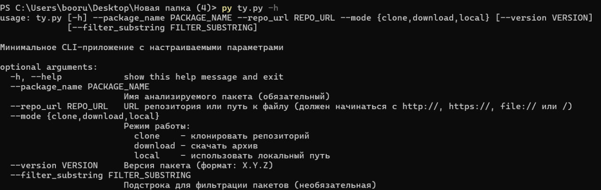
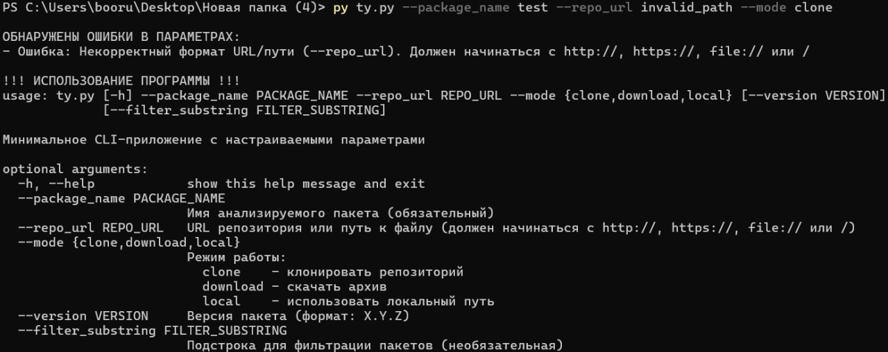

# Этап 2. Сбор данных
Цель: реализовать основную логику получения данных о зависимостях для их 
дальнейшего анализа и визуализации. Запрещено пользоваться менеджерами 
пакетов и сторонними библиотеками для получения информации о зависимостях 
пакетов.

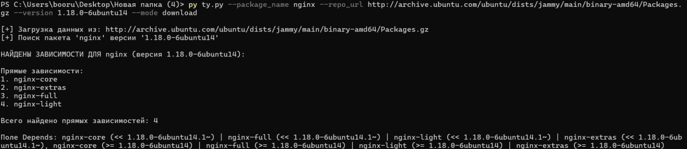

# Этап 3. Основные операции
Цель: построить граф зависимостей (с учетом транзитивности) и выполнить 
основные операции над ним.

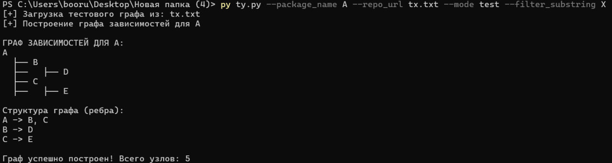
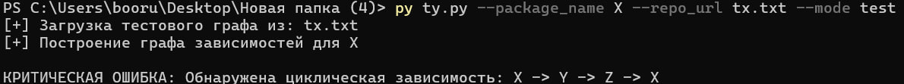
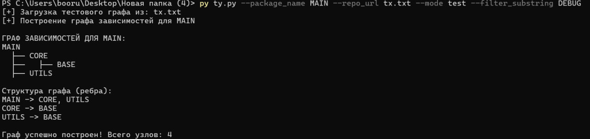

# Этап 4. Дополнительные операции
Цель: выполнить дополнительные операции над графом зависимостей.

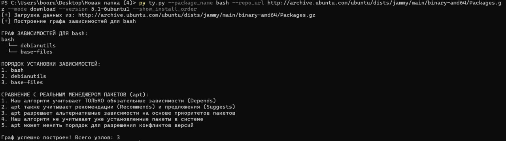
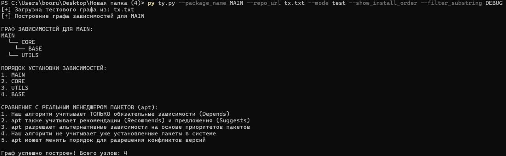

# Этап 5. Визуализация
Цель: получить графическое представление графа зависимостей.

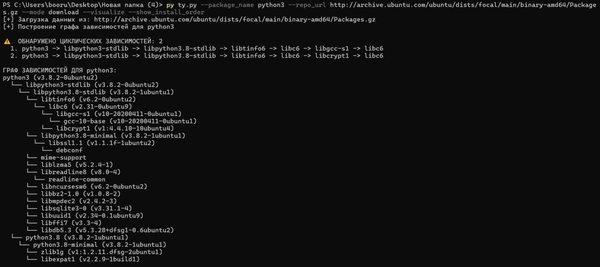
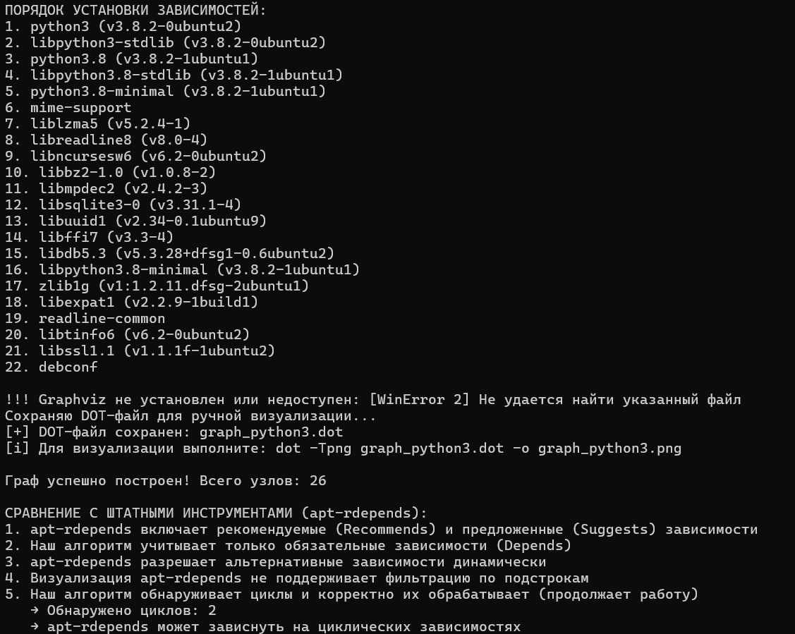
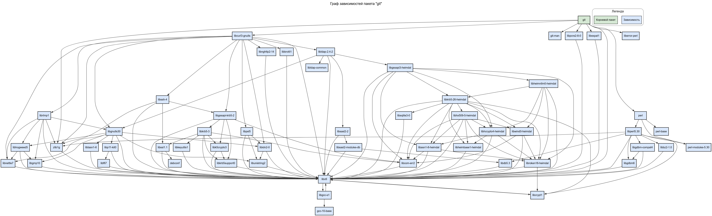
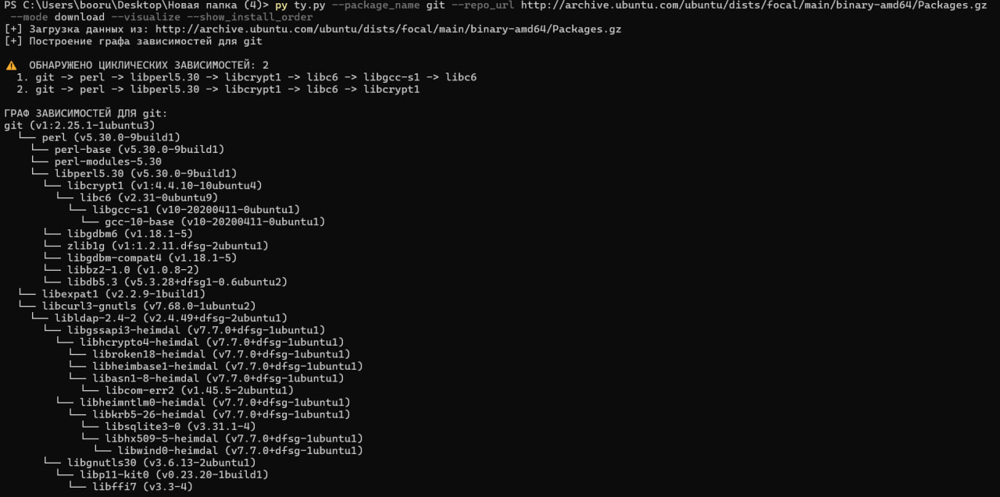
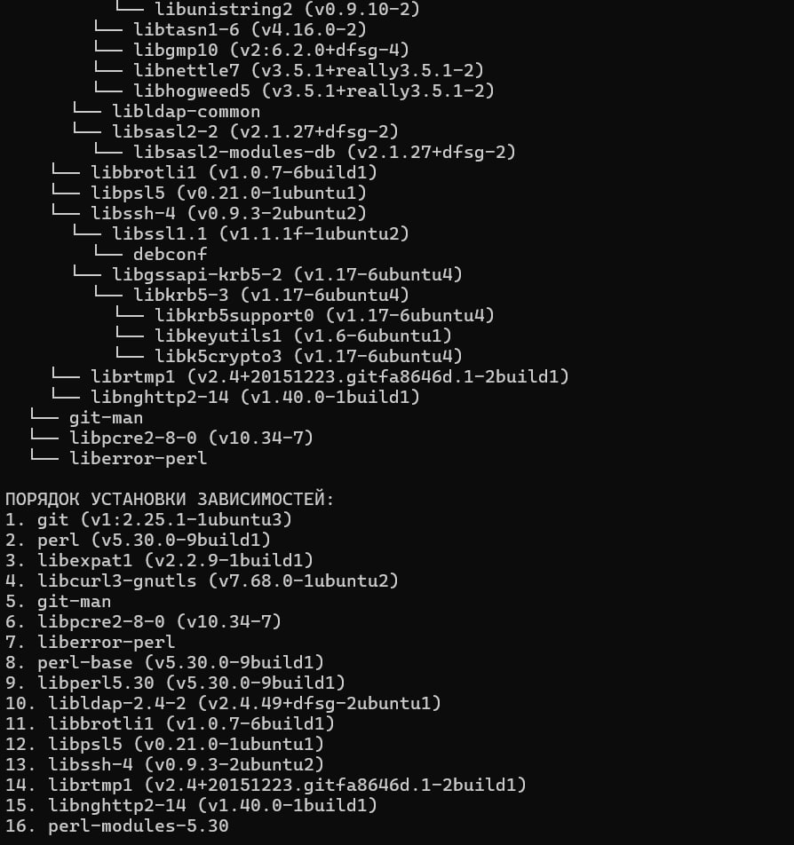
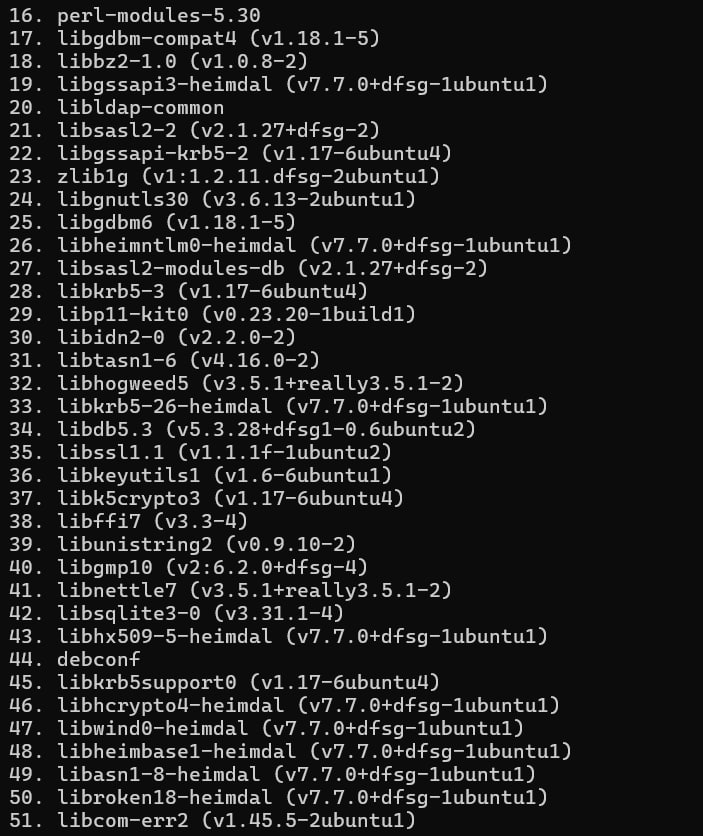
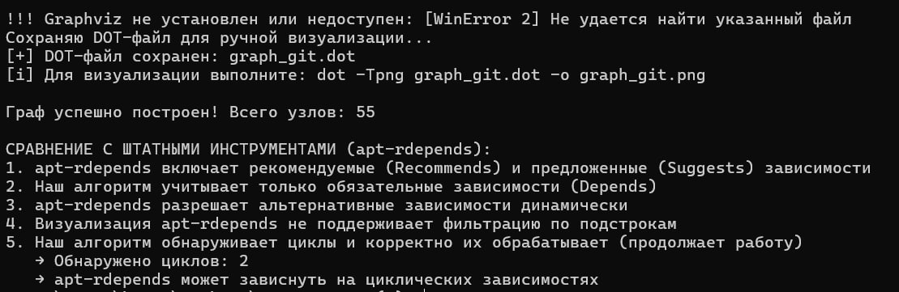
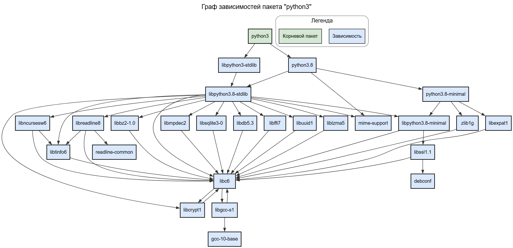
